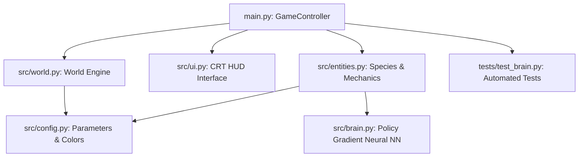
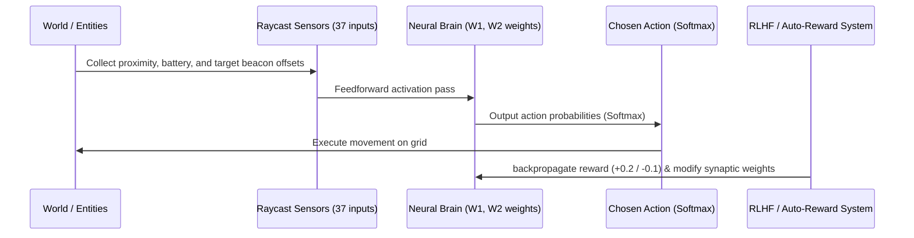

# Project Architecture & Scenario Expansion Documentation

This document provides a comprehensive technical overview of the architecture of **Nexus: Neural Survival Sandbox** and details the new features, upgrades, species, and ecological systems implemented during the scenario expansion.

---

## 1. Core System Architecture

The simulation is built on a modular, decoupled architecture in Pygame-ce and NumPy, structured around a massive **3200x3200** grid-based environment. The system comprises six core layers:



### Module Breakdown
*   **`main.py` (GameController)**: The main entry point. Orchestrates the game loop (60 FPS), tracks game state (paused/playing, selected entities), propagates keyboard/mouse inputs, renders active viewport layers, and updates entity states.
*   **`src/config.py` (Configuration Constants)**: Centralizes starting parameters, HSL dark-mode colors, species energy thresholds, tile types, and flashlight decay constants.
*   **`src/brain.py` (Neural Brain)**: Implements the neural network policies for Android agents. Manages forward propagation, temporal credit assignment, backpropagation via Policy Gradients, and raycasted sensory inputs.
*   **`src/world.py` (World Engine)**: Manages chunk-based (32x32) terrain generation, day/night cycles, global ambient lighting levels, radiation fields, and grass growth/decay grids.
*   **`src/entities.py` (Species & Upgrades)**: Defined state machines and behaviors for all physical agents: Androids, Humans, Wolves, Zombies, Animals, Food, Chargers, and Beacons.
*   **`src/ui.py` (HUD Framework)**: Emulates a retro phosphor-green and amber CRT terminal interface. Renders interactive inspector boxes, the live neural network synapse visualizer, and customizer text inputs.
*   **`src/utils.py` (Helper Library)**: Provides coordinate translation math (world-space to screen-space) and custom text renderer wrappers.

---

## 2. Updated & Newly Implemented Features

A suite of 5 distinct simulation use-cases and modules have been added to expand the sandbox's capabilities:

### A. Extended Neural Raycasting (Inputs 35 & 36)
*   **Implementation**: The `NeuralBrain` state inputs have been expanded from **35 to 37**. 
*   **Sensor Updates**: The system scans all entity chunks to find the nearest active `TargetBeacon`. It calculates the relative normalized distance vector:
    $$dx_{\text{norm}} = \frac{x_{\text{beacon}} - x_{\text{android}}}{16.0}$$
    $$dy_{\text{norm}} = \frac{y_{\text{beacon}} - y_{\text{android}}}{16.0}$$
    These values are assigned to inputs 35 and 36, giving Androids high-resolution spatial pathing to target beacons.

### B. Auto-Reward Navigation Training (RLHF Loop)
*   **Implementation**: Added an "Auto-Train to closest Beacon" checkbox.
*   **Logic**: During the simulation loop, the distance of the selected Android to its nearest target beacon is compared with its previous location:
    *   **Distance Decreased**: Rewards the network immediately: `brain.apply_rlhf_feedback(0.2)` and increments the UI rewards counter.
    *   **Distance Increased**: Punishes the network: `brain.apply_rlhf_feedback(-0.1)` and increments the punishments counter.
*   **Effect**: Allows rapid pathing convergence without requiring manual key feedback from the user.

### C. Predator Breeding & Behavior (`Wolf` Species)
*   **Implementation**: Added a fully autonomous `Wolf` entity (color: brown, starting count: 8).
*   **Behaviors**:
    1.  **Fleeing**: Runs away from Zombies if within 6.0 tiles.
    2.  **Hunting**: Seeks and hunts the nearest wild `Animal` (Prey) when hunger falls below 75%. Dealing damage and eating prey yields energy.
    3.  **Breeding**: If hunger is above 80.0 and mating cooldown is 0, they seek a partner wolf. Once adjacent, they spawn a new Wolf pup.
    4.  **Wandering**: Wanders randomly when fed.

### D. Flashlight Drainage & Blackout Mechanics
*   **Implementation**: Implemented flashlight drainage in the sunless preset (`PRESET_NO_SUN`).
*   **Rules**:
    *   Flashlight battery decays by `FLASHLIGHT_DECAY_RATE` (0.05) per frame for humans and androids.
    *   If battery drops to **0%**, the entity goes dark (its radial light mask cutout is suppressed).
    *   **Pickups/Recharge**: Humans restore battery by consuming `Food` pickups. Androids restore battery by standing on `Charger` pads. Beacons emit a constant, battery-independent neon cyan glow.

### E. Human Barricading & Zombie Wall-Smashing
*   **Implementation**: Programmed tactical physics interactions between Zombies and survivors:
    *   **Human Barricading**: Fleeing humans gather Wood from Grass tiles. When chased by a Zombie, they place a temporary Slate Wall barricade directly behind them (costs 2 wood).
    *   **Zombie Wall-Smashing**: Zombies check if their horizontal/vertical paths are blocked by a Wall tile. If blocked, they pause, enter a `"smashing"` state, and deal damage to the wall. At a random interval (matching the smash speed rate), the wall crumbles back into Dirt.

### F. Android Modular Upgrades
*   **Implementation**: Introduced two toggles in the Android Customizer panel:
    1.  **Solar pad module**: Android recharges battery directly when standing on tiles illuminated by daylight (light value > 60.0), removing complete reliance on charging pads.
    2.  **Radiation deflector shield**: Android ignores all damage from Radioactive Wasteland tiles, allowing free traversal in Nuclear winter scenarios.

### G. Vegetation Ecology Dynamics
*   **Implementation**: Adds environment regrowth and darkness-decay arrays:
    *   **Regrow chance**: Dirt tiles in active chunks have a randomized chance (`GRASS_REGROW_CHANCE` = 0.001) per frame to turn back into Grass.
    *   **Darkness decay**: Grass tiles unlit by flashlights in the sunless preset (light value < 15.0) slowly decay into Dirt.

### H. UI & Toolbar Improvements
*   **Brush Selection**: Added Paintbrush Slot 7 (`TargetBeacon` placement brush).
*   **Mouse Interaction**: The floating toolbar is now clickable; you can select brush tools by clicking on their respective slot previews or pressing keys `1` through `7`.
*   **Visual Highlights**: Highlights bounding boxes in the customizer text fields (`Name` and `Role`) and aligned the click target area of the Auto-Reward checkbox to avoid mismatching.

---

## 3. Data Flow Diagram

The diagram below represents how the environment and neural sensors feed into the Android's brain, and how user-controlled or automated RLHF feedback alters the connection weights:



---

## 4. Verification & Testing

### Automated Test Output
Unit tests inside `tests/test_brain.py` verify policy updates, temporal decay backpropagation, and target beacon input offset math. All tests pass successfully:

```powershell
python -m unittest tests/test_brain.py
.....
----------------------------------------------------------------------
Ran 5 tests in 1.616s

OK
```
